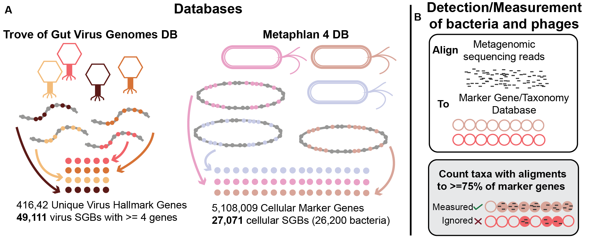

# Marker-MAGu

Trans-Kingdom Marker Gene Pipeline for Taxonomic Profiling of Human Metagenomes

If you want to detect and quantify phages, bacteria, archaea, and/or microeukaryotes in whole genome shotgun reads from human-derived samples, `Marker-MAGu` is the tool for you.

Basically, this tool uses the strategy (marker gene detection) and database (marker gene sequences) from [Metaphlan4](https://github.com/biobakery/MetaPhlAn), then:

1)  adds marker genes from 10s of thousands of phages derived from human metagenomes
2)  tweaks the thresholds so that phages and bacteria are detected with similar specificity and sensitivity

*The relative abundance of bacteria/archaea/microeukaryotes with be nearly identical to `Metaphlan4`, BUT `Marker-MAGu` is a bit less sensitive and a bit more specific. `Marker-MAGu` uses a stricter threshold (75% of marker genes) than `Metaphlan4` (33% of marker genes by default), so this is expected.*

Also, as in `Metaphlan4` **SGBs**, or **S**pecies-level **G**enome **B**ins are genomically-distinct species.

## Schematic



## Installation

**I have only tested this on Linux**

1)  Clone repo

`git clone https://github.com/cmmr/Marker-MAGu.git`

2)  Go to `Marker-MAGu` directory.

`cd Marker-MAGu`

3)  **Must have Conda installed:** use the file `environment/Marker-MAGu.yml` with `conda create` to generate the environment used with this tool.

`conda env create --file environment/Marker-MAGu.yml`

Note: if you can't or won't use `Conda` for environment management, you can check out the packages in`environment/Marker-MAGu.yml` and install packages manually.

4)  Activate the environment.

`conda activate Marker-MAGu`

5)  Download the database in the `Marker-MAGu` directory (\~9.6 GB when decompressed).

`cd Marker-MAGu`

`mkdir DBs && cd DBs`

`wget https://zenodo.org/record/7975097/files/Marker-MAGu_markerDB_v1.0.tar.gz`

`md5sum`

should return `2e3a44c790765c55dcdc5e5d4521ac3a`

`tar -xvf Marker-MAGu_markerDB_v1.0.tar.gz`

You should now have the database at: `Marker-MAGu/DBs/v1.0/Marker-MAGu_markerDB.fna`

`rm Marker-MAGu_markerDB_v1.0.tar.gz`

## (OPTIONAL) Database for filtering out host reads and spike-ins

You could filter unwanted sequences out upstream of this tool, but this will allow you to do it within `Marker-MAGu` using `minimap2`. The pipeline script will look for a file at `filter_seqs/filter_seqs.fna` which could be any fasta-formatted sequence file you want to use to remove matching reads (e.g. from host or spike-in).

Here are instructions for downloading and formatting the human genome and phiX spike-in (3 GB decompressed).

```         
cd Marker-MAGu
mkdir filter_seqs && cd filter_seqs

## download phiX genome and gunzip
wget https://ftp.ncbi.nlm.nih.gov/genomes/refseq/viral/Sinsheimervirus_phiX174/latest_assembly_versions/GCF_000819615.1_ViralProj14015/GCF_000819615.1_ViralProj14015_genomic.fna.gz
gunzip GCF_000819615.1_ViralProj14015_genomic.fna.gz

## download human genome and gunzip
wget https://ftp.ncbi.nlm.nih.gov/genomes/refseq/vertebrate_mammalian/Homo_sapiens/latest_assembly_versions/GCF_009914755.1_T2T-CHM13v2.0/GCF_009914755.1_T2T-CHM13v2.0_genomic.fna.gz
gunzip GCF_009914755.1_T2T-CHM13v2.0_genomic.fna.gz

## concatenate files
cat GCF_000819615.1_ViralProj14015_genomic.fna GCF_009914755.1_T2T-CHM13v2.0_genomic.fna > filter_seqs.fna

## optionally delete separate files
rm GCF_000819615.1_ViralProj14015_genomic.fna GCF_009914755.1_T2T-CHM13v2.0_genomic.fna
```

Remember to set `-f True` to run the filtering step.

# Running the tool

**I have only tested this on Linux and I doubt it would work on MacOS or Windows**

You might run this as part of a bash script, do your own upstream read processing, etc, but these are the basic instructions.

*Required inputs:*

`-r reads file(s) (.fastq)`

`-s sample name (no space characters)`

`-t # of threads`

`-o output directory (may be shared with other samples)`

Activate the conda environment:

`conda activate Marker-MAGu`

Individual samples can be run with the python script. E.g.:

**Basic run with 1 .fastq file:**

```         
python /path/to/Marker-MAGu/scripts/run_Marker-MAGu.py -r /path/to/reads/myreads.fastq -s sample_ABC -t 16 -o myproject_MM1
```

**Using multiple input .fastq files (`Marker-MAGu` doesn't used paired-end info)**

```         
python /path/to/Marker-MAGu/scripts/run_Marker-MAGu.py -r /path/to/reads/myreads1.fastq /path/to/reads/myreads2.fastq -s sample_ABC -t 16 -o myproject_MM1
```

**Using multiple input .fastq files with wildcard**

```         
python /path/to/Marker-MAGu/scripts/run_Marker-MAGu.py -r /path/to/reads/*.fastq -s sample_ABC -t 16 -o myproject_MM1
```

**With pre-filtering steps:**

```         
python /path/to/Marker-MAGu/scripts/run_Marker-MAGu.py -r /path/to/reads/myreads.fastq -s sample_ABC -t 16 -o myproject_MM1 -q True -f True
```

**Help menu**

```         
python /path/to/Marker-MAGu/scripts/run_Marker-MAGu.py -h
```

## Combine Output tables in a Project Directory

**The project directory should have multiple `*.detected_species.tsv` tables.**

Activate conda environment: `conda activate Marker-MAGu`

Then, run Rscript with the project directory as the first and only argument:

```         
Rscript /path/to/Marker-MAGu/scripts/combine_sample_tables1.R myproject_MM1
```

This command will generate the table `myproject_MM1.combined_profile.tsv`.

# Notes for Users

### Resource Usage

In my experience, the step which uses `minimap2` to align reads to the marker gene database uses about 66GB of memory.

**Insert time tests with different #CPUS and #reads**

### Output table

`Marker-MAGu` outputs a long form table, and the combined outputs (from `combine_sample_tables1.R`) are long form. This allows for a smaller file size and nimbler downstream analysis, in my opinion. Major bioinformatics coding languages can convert long form tables to wide form.

An example in `R` using Tidyverse packages:

```{r}
library(data.table)
library(stringr)
library(dplyr)
library(tidyr)

long_dt <- fread("myproject_MM1.combined_profile.tsv", 
                  sep = "\t", header = T) %>%
  mutate(SGB = gsub(".*s__","s__", lineage ), 
  genus = gsub(".*g__","g__", lineage ), 
  genus = gsub("\\|s__.*", "", genus),
  kingdom = gsub("\\|.*", "", lineage))

wide_dt <- long_dt %>%
  subset( select = c("SGB", "rel_abundance", "sampleID")) %>%
  pivot_wider(names_from = sampleID, 
              values_from = rel_abundance, values_fill = 0)
```

### Other notes

Relative abundance values from each sample will add up to 1, so there is no "unknown fraction estimate"

Currently, `Marker-MAGu` only profiles phages with 4 or more unique marker genes, so small, ssDNA phages such as microviruses and inoviruses are unlikely to be detectable. I'm working on it.

Should any issues arise, please leave an issue in this GitHub Repo.

# Adding your own virus hallmark genes to Marker-MAGu

A command line walkthrough for users wishing to add their own viruses to the `Marker-MAGu` DB. While `Marker-MAGu` itself is pretty simple, it can be a bit involved to make and format marker genes. But, hey, let's do it.

### Input

Multi-fasta file with genome sequences of viruses. If you have a very large file (thousands of genomes), the hmmscan and BLASTN steps may take a while.

In this walkthrough, we will use `my_viruses1.fna`, so we will set a variable with the stem of this file name:

`MYSEQS="my_viruses1"`

### Package/tool versions used

It might be easiest to install these in a new conda environment. Tool versions might not matter too much.

```         
seqkit v2.2.0
bioawk v1.0
prodigal v2.6.3
hmmer v3.3
blast v2.9.0
```

### HMMER database for virus hallmark gene identification

*This is the HMMER database used by `Cenote-Taker 2` for virus identification*

**1) navigate to a new directory for processing data**

**2) download DB**

`wget https://zenodo.org/record/4966268/files/hmmscan_DBs.tgz`

**3) unpack**

`tar -xvf hmmscan_DBs.tgz`

### Call ORFs, Identify hallmark genes

**1) call genes**

make sure variable is set for your file `MYSEQS="my_viruses1"`
```         
prodigal -a ${MYSEQS}.prot.faa -d ${MYSEQS}.genes.fna -i ${MYSEQS}.fna -p meta -q
```

**2) hmmscan virus virion and replication HMMER databases**

```         
hmmscan --tblout ${MYSEQS}.hmmscan_virion.out --cpu 16 -E 1e-8 --noali hmmscan_DBs/virus_specific_baits_plus_missed6a ${MYSEQS}.prot.faa
```

then

```         
hmmscan --tblout ${MYSEQS}.hmmscan_replicate.out --cpu 16 -E 1e-15 --noali hmmscan_DBs/virus_replication_clusters3 ${MYSEQS}.prot.faa
```

**3) combine tables**

```         
cat ${MYSEQS}.hmmscan_virion.out ${MYSEQS}.hmmscan_replicate.out | grep -v "^#" | sed 's/ \+/\'$'\t/g' | sort -u -k3,3 > ${MYSEQS}.all_hmmscan_fmt.out
```

```         
cut -f3 ${MYSEQS}.all_hmmscan_fmt.out > ${MYSEQS}.hallmark_gene_list.txt
```

**4) Retreive hallmark genes**

```         
seqkit grep -j 16 -f ${MYSEQS}.hallmark_gene_list.txt ${MYSEQS}.genes.fna > ${MYSEQS}.hallmark_genes.nucl.fna
```

```         
seqkit grep -j 16 -f ${MYSEQS}.hallmark_gene_list.txt ${MYSEQS}.prot.faa > ${MYSEQS}.hallmark_genes.prot.faa
```

### Parse genomes

**1) Get list of genomes with minimum number of hallmark genes**

This command will only keep genomes with 4 or more hallmark genes as is recommended for `Marker-MAGu`. See awk expression `if ($1>=4)`.

```
sed 's/[^_]*$//' ${MYSEQS}.hallmark_gene_list.txt | sort | uniq -c | awk '{if ($1>=4) {print $2}}' > ${MYSEQS}.marker_genomes_list.txt
```

**2) Make fastas of genome-specific marker genes**

```
mkdir indiv_genomes

cat ${MYSEQS}.marker_genomes_list.txt | xargs -n 1 -I {} -P 16 seqkit grep -j 1 --quiet -r -p "{}" ${MYSEQS}.hallmark_genes.nucl.fna -o indiv_genomes/{}_hmg.fna
```

**3) Concatenate hallmark genes for each genome**

```
HMGS=$( find indiv_genomes/ -type f -name "*__hmg.fna" | sed 's/\.fna//g' )
if [ -n "$HMGS" ] ; then
	for HM in $HMGS ; do 
		bioawk -v genq="${HM#indiv_genomes/}" -c fastx '{if (NR == 1) {print ">"genq ; print $seq} else {print $seq }}' ${HM}.fna > ${HM}.concat.fna ; 
	done
else
	echo "hallmark gene files for each genome NOT found"
fi

cat indiv_genomes/*_hmg.concat.fna > ${MYSEQS}.hallmark_genes.nucl.concat.fna
```

### Compare concatenated hallmark gene sequences against each other to dereplicate redundant sequences

NOTE: If all-vs-all BLASTN only returns self-alignments, the `anicalc.py` script will return an error. In this case, just use the `${MYSEQS}.marker_genomes_list.txt` file instead of the `${MYSEQS}.hallmark_genes.nucl.concat.exemplars1.txt` for step 3).


**1) BLASTN**

```
mkdir blast_DBs

makeblastdb -in ${MYSEQS}.hallmark_genes.nucl.concat.fna -dbtype nucl -out blast_DBs/${MYSEQS}.hallmark_genes.nucl.concat

blastn -query ${MYSEQS}.hallmark_genes.nucl.concat.fna -db blast_DBs/${MYSEQS}.hallmark_genes.nucl.concat -outfmt '6 std qlen slen' -max_target_seqs 10000 -perc_identity 90 -out ${MYSEQS}.hallmark_genes.nucl.concat.blastn.tsv -num_threads 16
```

**2) anicalc/aniclust to find redundant sequences**

```
python /path/to/Marker-MAGu/scripts/anicalc.py -i ${MYSEQS}.hallmark_genes.nucl.concat.blastn.tsv -o ${MYSEQS}.hallmark_genes.nucl.concat.anicalc.tsv

python /path/to/Marker-MAGu/scripts/aniclust.py --fna ${MYSEQS}.hallmark_genes.nucl.concat.fna --ani ${MYSEQS}.hallmark_genes.nucl.concat.anicalc.tsv --out ${MYSEQS}.hallmark_genes.nucl.concat.aniclust.ANI95_TCOV85.tsv --min_ani 95 --min_tcov 85 --min_qcov 0

cut -f1 ${MYSEQS}.hallmark_genes.nucl.concat.aniclust.ANI95_TCOV85.tsv > ${MYSEQS}.hallmark_genes.nucl.concat.exemplars1.txt
```

**3) Retreive all the INDIVIDUAL hallmark genes for exemplars**

```
bioawk -c fastx '{print $name, $seq}' ${MYSEQS}.hallmark_genes.nucl.fna | grep -F -f ${MYSEQS}.hallmark_genes.nucl.concat.exemplars1.txt | awk '{OFS=FS="\t"}{print ">" $1 ; print $2}' > ${MYSEQS}.hallmark_genes.nucl.exemplars1.fna
```

### Add marker genes to Marker-MAGu

**1) Format marker genes for `Marker-MAGu`**

This is kind of an unrefined piece of code as it does not assign meaningful taxonomical assignments at any level except species ("s__"), which it merely assigns the sequence name. However, it does fulfill the requirements for `Marker-MAGu`, which is to format the header as:

*gene_name;hierarchical_taxonomy;genome_of_origin_name*

```
sed 's/[^_]*$/@_&/ ; s/^@_//g' ${MYSEQS}.hallmark_genes.nucl.exemplars1.fna | bioawk -c fastx '{ split($name, a, "_@") ; print ">"a[1]a[2]";k__Viruses|p__Unclassified_viruses|c__Unclassified_viruses|o__Unclassified_viruses|f__Unclassified_viruses|g__Unclassified_viruses|s__vOTU_"a[1]";"a[1] ; print $seq}' > ${MYSEQS}.hallmark_genes.nucl.exemplars1.fmt.fna
```

If you want to assign more complex taxonomy to your sequences based on some other tool, please make an Issue and I can upload some additional scripts to the repo to facilitate this.

**2) Concatenate your formatted marker genes to the existing `Marker-MAGu` database** 

```
cd Marker-MAGu/DBs

mkdir v_${MYSEQS}

cat v1.0/Marker-MAGu_markerDB.fna /path/to/${MYSEQS}.hallmark_genes.nucl.exemplars1.fmt.fna > v_${MYSEQS}/Marker-MAGu_markerDB.fna
```

That's it. Remember to specify the updated database when running `Marker-MAGu`. E.g. `--db v_my_viruses1`


## Citation

(insert)
