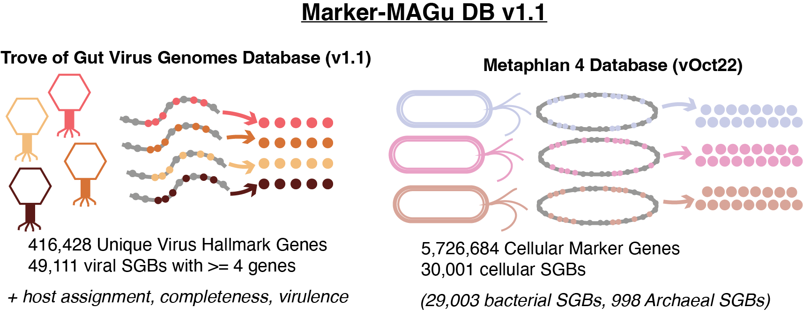

# Marker-MAGu

Trans-Kingdom Marker Gene Pipeline for Taxonomic Profiling of Human Metagenomes

If you want to detect and quantify phages, bacteria, archaea, and/or microeukaryotes in whole genome shotgun reads from human-derived samples, `Marker-MAGu` is the tool for you.

Basically, this tool uses the strategy (marker gene detection) and database (marker gene sequences) from [Metaphlan4](https://github.com/biobakery/MetaPhlAn), then:

1)  adds marker genes from 10s of thousands of phages derived from human metagenomes
2)  tweaks the thresholds so that phages and bacteria are detected with similar specificity and sensitivity

*The relative abundance of bacteria/archaea/microeukaryotes with be nearly identical to `Metaphlan4`, BUT `Marker-MAGu` is a bit less sensitive and a bit more specific. `Marker-MAGu` uses a stricter threshold (75% of marker genes) than `Metaphlan4` (33% of marker genes by default), so this is expected.*

Also, as in `Metaphlan4` **SGBs**, or **S**pecies-level **G**enome **B**ins are genomically-defined species.

## Schematic



## Installation

**I have only tested this on Linux**

1)  Clone repo

`git clone https://github.com/cmmr/Marker-MAGu.git`

2)  Go to `Marker-MAGu` directory.

`cd Marker-MAGu`

3)  use the file `environment/Marker-MAGu.yml` with `conda create` to generate the environment used with this tool

`conda env create --file environments/Marker-MAGu.yml`

4)  Activate the environment

`conda activate Marker-MAGu`

5)  Download the database in the `Marker-MAGu` directory (\~300 MB when decompressed).

`cd Marker-MAGu`

***Add in when database is uploaded to Zenodo*** `wget`

`md5sum`

should return `md5sum digits`

`tar -xvf tar.gz`

`rm tar.gz`

## (OPTIONAL) Database for filtering out host reads and spike-ins

You could filter unwanted sequences out upstream of this tool, but this will allow you to do it within `Marker-MAGu` using `minimap2`. The pipeline script will look for a file at `filter_seqs/filter_seqs.fna` which could be any fasta-formatted sequence file you want to use to remove matching reads (e.g. from host or spike-in).

Here are instructions for downloading and formatting the human genome and phiX spike-in (3 GB decompressed).

```         
cd Marker-MAGu
mkdir filter_seqs && cd filter_seqs

## download phiX genome and gunzip
wget https://ftp.ncbi.nlm.nih.gov/genomes/refseq/viral/Sinsheimervirus_phiX174/latest_assembly_versions/GCF_000819615.1_ViralProj14015/GCF_000819615.1_ViralProj14015_genomic.fna.gz
gunzip GCF_000819615.1_ViralProj14015_genomic.fna.gz

## download human genome and gunzip
wget https://ftp.ncbi.nlm.nih.gov/genomes/refseq/vertebrate_mammalian/Homo_sapiens/latest_assembly_versions/GCF_009914755.1_T2T-CHM13v2.0/GCF_009914755.1_T2T-CHM13v2.0_genomic.fna.gz
gunzip GCF_009914755.1_T2T-CHM13v2.0_genomic.fna.gz

## concatenate files
cat GCF_000819615.1_ViralProj14015_genomic.fna GCF_009914755.1_T2T-CHM13v2.0_genomic.fna > filter_seqs.fna

## optionally delete separate files
rm GCF_000819615.1_ViralProj14015_genomic.fna GCF_009914755.1_T2T-CHM13v2.0_genomic.fna
```

Remember to set `-f True` to run the filtering step.

# Running the tool

**I have only tested this on Linux and I doubt it would work on MacOS or Windows**

You might run this as part of a bash script, do your own upstream read processing, etc, but these are the basic instructions.

*Required inputs:*

`-r reads file (.fastq)`

`-s sample name`

`-t # of threads`

`-o output directory (may be shared with other samples)`

Activate the conda environment:

`conda activate Marker-MAGu`

Individual samples can be run with the python script. E.g.:

**Basic run with 1 .fastq file:**

```         
python /path/to/Marker-MAGu/scripts/run_Marker-MAGu.py -r /path/to/reads/myreads.fastq -s sample_ABC -t 16 -o myproject_MM1
```

**Using multiple input .fastq files (`Marker-MAGu` doesn't used paired-end info)**

```         
python /path/to/Marker-MAGu/scripts/run_Marker-MAGu.py -r /path/to/reads/myreads1.fastq /path/to/reads/myreads2.fastq -s sample_ABC -t 16 -o myproject_MM1
```

**Using multiple input .fastq files with wildcard**

```         
python /path/to/Marker-MAGu/scripts/run_Marker-MAGu.py -r /path/to/reads/*.fastq -s sample_ABC -t 16 -o myproject_MM1
```

**With pre-filtering steps:**

```         
python /path/to/Marker-MAGu/scripts/run_Marker-MAGu.py -r /path/to/reads/myreads.fastq -s sample_ABC -t 16 -o myproject_MM1 -q True -f True
```

**Help menu**

```         
python /path/to/Marker-MAGu/scripts/run_Marker-MAGu.py -h
```

## Combine Output tables in a Project Directory

**The project directory should have multiple `*.detected_species.tsv` tables.**

Activate conda environment: `conda activate Marker-MAGu`

Then, run Rscript with the project directory as the first and only argument:

```         
Rscript /path/to/Marker-MAGu/scripts/combine_sample_tables1.R myproject_MM1
```

This command will generate the table `myproject_MM1.combined_profile.tsv`.

# Notes for Users

### Resource Usage

In my experience, the step which uses `minimap2` to align reads to the marker gene database uses about 66GB of memory.

**Insert time tests with different #CPUS and #reads**

### Output table

`Marker-MAGu` outputs a long form table, and the combined outputs (from `combine_sample_tables1.R`) are long form. This allows for a smaller file size and nimbler downstream analysis, in my opinion. Major bioinformatics coding languages can convert long form tables to wide form.

An example in `R` using Tidyverse packages:

```{r}
library(data.table)
library(stringr)
library(dplyr)
library(tidyr)

long_dt <- fread("myproject_MM1.combined_profile.tsv", 
                  sep = "\t", header = T) %>%
  mutate(SGB = gsub(".*s__","s__", lineage ), 
  genus = gsub(".*g__","g__", lineage ), 
  genus = gsub("\\|s__.*", "", genus),
  kingdom = gsub("\\|.*", "", lineage))

wide_dt <- long_dt %>%
  subset( select = c("SGB", "rel_abundance", "sampleID")) %>%
  pivot_wider(names_from = sampleID, 
              values_from = rel_abundance, values_fill = 0)
```

### Other notes

Relative abundance values from each sample will add up to 1, so there is no "unknown fraction estimate"

Currently, `Marker-MAGu` only profiles phages with 4 or more unique marker genes, so small, ssDNA phages such as microviruses and inoviruses are unlikely to be detectable. I'm working on it.

Should any issues arise, please leave an issue in this GitHub Repo.
